# revealjs-infograph

Infographics grounded in cognitive science, built from **HTML attributes alone**, for reveal.js.

```html
<div data-infograph="waffle" data-value="43.8%" data-label="Respondents who agreed"></div>
```

No coordinates, no colours, no legend placement, no alt text to write by hand. Those all follow
from what you're trying to say — they aren't something to redecide on every slide.

- **No more hand-tuned SVG coordinates** — nothing to nudge by `left: 60px` every time the copy changes
- **The palette is verified** — contrast ratio and colour-vision-deficiency ΔE2000 are enforced in CI (`npm run validate:palette`)
- **The resting state is the finished state** — print, `prefers-reduced-motion`, and no-JS all produce the same correct figure
- **Zero dependencies** — even reveal.js is an optional peer; `renderAll()` works on a plain HTML page

See [docs/principles.md](docs/principles.md) for the full principle-by-principle map of what's
enforced and where.

---

## Gallery

| Form                                                                                              |                                                                                                              |     |
| ------------------------------------------------------------------------------------------------- | ------------------------------------------------------------------------------------------------------------ | --- |
| [`stat`](#stat--a-single-headline-number)<br>a single headline number                             |                                     |
| [`waffle`](#waffle--a-share-of-the-whole)<br>a share of the whole, countable instead of estimated | 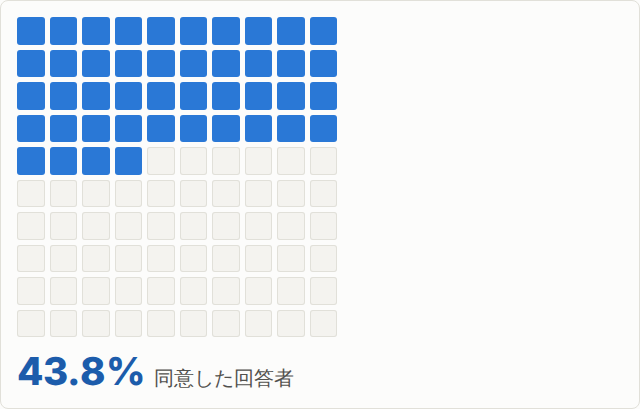                                |
| [`bar`](#bar--comparing-quantities)<br>comparing quantities, with one or more emphasised          | 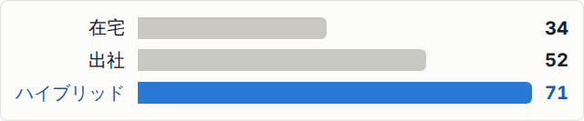     |
| [`flow`](#flow--stages-in-order)<br>ordered stages with explicit connectors                       | 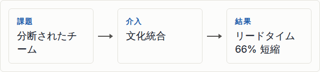                                    |
| [`compare`](#compare--two-points-in-time)<br>two points in time, with the delta computed for you  | 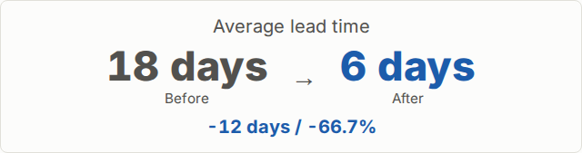                              |
| [`venn`](#venn--when-the-overlap-is-the-point)<br>when the overlap between two sets is the point  | 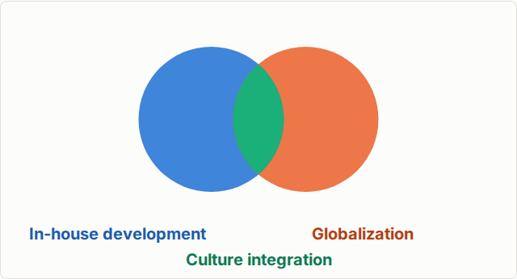                            |
| [`pyramid`](#pyramid--a-hierarchy-narrowest-at-the-top)<br>a hierarchy, narrowest at the top      | 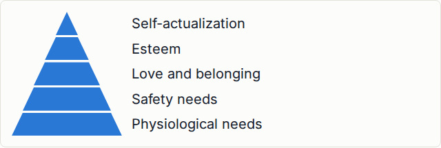 |
| [`cycle`](#cycle--a-process-that-repeats)<br>a continuous, repeating process                      | 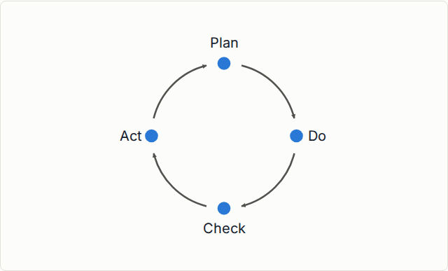                            |
| [`quadrant`](#quadrant--four-labelled-buckets)<br>four labelled buckets on two axes               | 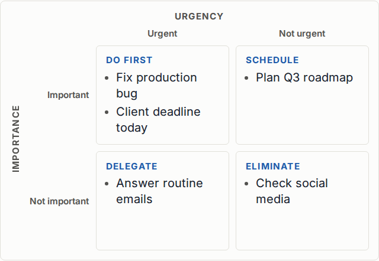         |
| [pictogram marks](#pictogram-marks)<br>`waffle` and `bar` drawn as repeated silhouettes           | 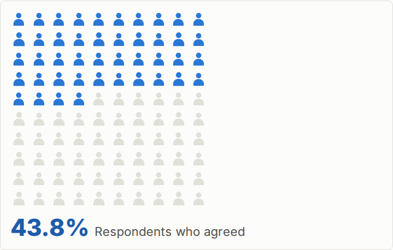   |

These images are the exact artifacts `npm run test:visual:docker` generates and verifies inside a
pinned Docker container (see [CONTRIBUTING.md](CONTRIBUTING.md#visual-testing)) — not a
hand-curated screenshot that can go stale, but the actual, currently-correct output.

**[Live playground →](https://yuichi1004.github.io/revealjs-infograph/)** — every form, interactive.

---

## Getting started

### With a bundler (Vite, etc.)

```sh
npm i revealjs-infograph
```

```js
import Reveal from 'reveal.js';
import 'reveal.js/reveal.css';
import 'reveal.js/theme/white.css';

import Infograph from 'revealjs-infograph';
import 'revealjs-infograph/styles.css'; // after reveal's theme, before your own overrides

new Reveal(document.querySelector('.reveal'), {
  plugins: [Infograph],
}).initialize();
```

If you already have shared deck-initialisation code, this is one more entry in the `plugins` array.

```js
plugins: [Highlight, Notes, CountUp, Infograph, ...(options.plugins ?? [])],
```

### With a script tag / CDN

```html
<link rel="stylesheet" href="dist/infograph.css" />
<script src="dist/infograph.iife.js"></script>
<script>
  Reveal.initialize({ plugins: [RevealInfograph] });
</script>
```

### Without reveal.js

```js
import { renderAll } from 'revealjs-infograph';
renderAll(document.body);
```

Pass a second argument — `resolveConfig({ maxSeries: 6 })`, say — to override the deck-wide
defaults from `src/options.js`; `renderAll(document.body)` alone uses them as-is.

---

## Colours are inherited automatically

The variables in `styles/infograph.css` are defined as fallbacks onto the host's own tokens.

```css
--ig-mark-1: var(--c-blue, #2a78d6);
```

So a deck that already defines `--c-blue` gets figures in **its own brand colours, with no
configuration**. To override explicitly, define `--ig-mark-1` directly. If neither is defined, a
verified default palette is used.

| Variable                        | Purpose                                            | Host fallback                      |
| ------------------------------- | -------------------------------------------------- | ---------------------------------- |
| `--ig-mark-1` `-2` `-3`         | Fills (bars, cells, circles). Never for small text | `--c-blue` `--c-orange` `--c-aqua` |
| `--ig-ink-1` `-2` `-3`          | The same hues, darkened to 4.5:1 for text          | `--c-blue-deep` etc.               |
| `--ig-surface` `--ig-surface-2` | Background                                         | `--surface` `--surface-2`          |
| `--ig-text` `--ig-text-2`       | Body / secondary text                              | `--ink` `--ink-2`                  |
| `--ig-muted`                    | De-emphasised gray                                 | `--muted-mark`                     |
| `--ig-figure-width`             | Max figure width                                   | —                                  |

---

## Authoring rules

There are exactly three.

| Notation               | Meaning                                                  |
| ---------------------- | -------------------------------------------------------- |
| `data-infograph="..."` | Which form to render                                     |
| `data-*` (plain)       | That form's **data** (values, labels, items)             |
| `data-ig-*`            | The plugin's **behaviour** (palette, density, animation) |

Same split the `count-up` plugin uses with `data-count-up-*` — glancing at a slide, you can tell
which attributes carry meaning and which carry preference.

---

## Form reference

### `stat` — a single headline number


```html
<div
  data-infograph="stat"
  data-value="43.8%"
  data-label="Respondents who say culture integration drove the results"
  data-note="n=1,204 · 2026 internal survey"
></div>
```

One quantity doesn't need the scaffolding of comparison. An axis, a scale, a mark would all be
decoration carrying zero information.

| Attribute    | Meaning                                                                |
| ------------ | ---------------------------------------------------------------------- |
| `data-value` | The number (`43.8%`, `1,204`, `$1,234K`, `18 days` — any format works) |
| `data-label` | What was counted                                                       |
| `data-note`  | Source, period, or other footnote                                      |

### `waffle` — a share of the whole


```html
<div data-infograph="waffle" data-value="43.8%" data-label="Respondents who agreed"></div>
<div data-infograph="waffle" data-value="438" data-total="1000"></div>
```

A 10×10 grid. Where a pie chart asks you to judge angle and area, this turns the same question into
**counting** — four rows and four cells reads as "44," not "a bit under half."

Cell count rounds to the nearest integer, but **the printed value is always exactly what the author
wrote**.

The grid fills in reading order — top-left, row by row — so "count the rows" never leaves a reader
hunting for where counting starts. The trade-off: below roughly half, that puts the caption next to
the empty rows rather than the filled ones. A bottom-up ("level") fill would fix that at the cost of
reordering the fill and its entrance animation; see [`docs/principles.md`](docs/principles.md) for
the fuller reasoning behind keeping reading order.

| Attribute    | Meaning                                             |
| ------------ | --------------------------------------------------- |
| `data-value` | A share (`43.8%`) or a count (`438`)                |
| `data-total` | The denominator when using a count. Defaults to 100 |
| `data-label` | What the share represents                           |

### `bar` — comparing quantities

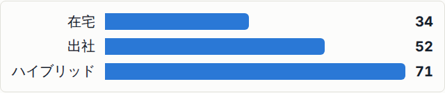

```html
<div data-infograph="bar" data-items="Remote: 34, Office: 52, Hybrid: 71"></div>
```

Horizontal bars. Category names are words, and words run wide — a horizontal bar lets each one sit
on its own row with no rotation and no truncation. The baseline is always zero; axis truncation
isn't implemented, because it's the thing that stops length from meaning quantity.

Add an emphasis and that bar keeps its colour while the rest drop to gray — mark more than one
(`data-emphasis="2,3"`) to keep several:


```html
<div data-infograph="bar" data-label="Where people work each week" data-emphasis="3">
  <div data-item="Remote" data-value="34"></div>
  <div data-item="Office" data-value="52"></div>
  <div data-item="Hybrid" data-value="71"></div>
</div>
```

| Attribute       | Meaning                                                                                                     |
| --------------- | ----------------------------------------------------------------------------------------------------------- |
| `data-items`    | `label: value` pairs, comma-separated                                                                       |
| `data-emphasis` | Which item(s) to emphasise (1-based, comma-separated for several). A child's own `data-emphasis` also works |
| `data-label`    | The figure's overall name (used as the accessible name and the hidden table's caption)                      |

### `flow` — stages in order


```html
<div data-infograph="flow" data-ig-fragment="steps">
  <div data-step="Problem">Fragmented teams</div>
  <div data-step="Intervention">Culture integration</div>
  <div data-step="Result">66% shorter lead time</div>
</div>
```

An arrow always sits between stages. Boxes in a row read as a "group" by proximity alone, so
something has to state direction explicitly. Add `data-ig-fragment="steps"` to reveal one stage at
a time as a reveal.js fragment.

| Attribute                  | Meaning                                                           |
| -------------------------- | ----------------------------------------------------------------- |
| `<div>` / `data-step`      | One stage's label, in order                                       |
| `data-emphasis`            | Which step(s) to emphasise (1-based, comma-separated for several) |
| `data-icon` on a stage     | See [Icons](#icons) below                                         |
| `data-ig-fragment="steps"` | Reveal one stage at a time as a reveal fragment                   |

### `compare` — two points in time


```html
<div data-infograph="compare" data-label="Average lead time">
  <div data-item="Before" data-value="18 days"></div>
  <div data-item="After" data-value="6 days"></div>
</div>
```

**The delta (`-12 days / -66.7%`) is computed automatically** — it's usually the actual point of
the slide. Leave the arithmetic to the audience and everyone finishes at a different pace while the
talk has already moved on.

The second item (usually the point being made) is emphasised by default; move it with
`data-emphasis="1"`, or emphasise both with `data-emphasis="1,2"`. No relative change is shown
when the baseline is ≤ 0 (it would be a meaningless number).

### `venn` — when the overlap is the point


```html
<div
  data-infograph="venn"
  data-overlap="0.35"
  data-a="In-house development"
  data-b="Globalization"
  data-ab="Culture integration"
></div>
```

The intersection is a real lens, clipped out of the two circles — not a third circle floated on
top, which would read as "a third category adjacent to both," contradicting the point.

| Attribute         | Meaning                                                                 |
| ----------------- | ----------------------------------------------------------------------- |
| `data-a` `data-b` | Names of the two sets                                                   |
| `data-ab`         | Name of the intersection                                                |
| `data-overlap`    | 0–1. 0 keeps the circles apart, 1 makes them coincide. Defaults to 0.35 |

Three circles are never drawn — seven regions can't be solved mid-talk. Two separate figures
communicate better than one over-complicated one.

**Adjusting the overlap** — `data-overlap` alone drives the whole shape:

| `data-overlap="0.05"`                                                                 | `data-overlap="0.35"` (default)                                                        | `data-overlap="0.55"`                                                               |
| ------------------------------------------------------------------------------------- | -------------------------------------------------------------------------------------- | ----------------------------------------------------------------------------------- |
| 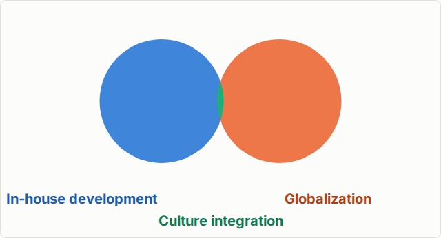 |  | 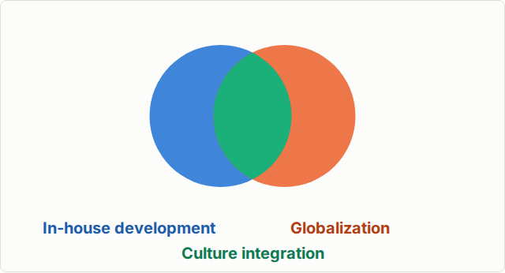 |

### `pyramid` — a hierarchy, narrowest at the top


```html
<div data-infograph="pyramid">
  <ul>
    <li>Self-actualization</li>
    <li>Esteem</li>
    <li>Love and belonging</li>
    <li>Safety needs</li>
    <li>Physiological needs</li>
  </ul>
</div>
```

First item is the apex, last is the base — the same order a reader already scans a list in.

**Width states rank, not magnitude.** This is the same argument `venn` makes for area: the claim is
topological ("this sits above that"), and there is no quantity being judged. A pyramid whose widths
_did_ encode a value would be the trapezoid version of a pie chart — area grows faster than width,
so a reader judging area misjudges the number. Give a tier a `data-value` and it's printed, with an
advisory pointing at `bar` or `waffle` for a quantitative story instead:

```html
<div data-infograph="pyramid">
  <ul>
    <li>Enterprise: 400</li>
    <li>Mid-market: 1,200</li>
    <li>Self-serve: 8,600</li>
  </ul>
</div>
```

`data-level` children and the `data-items` shorthand also work, via the same attribute-reading chain
every other form uses. `data-emphasis` highlights one or more tiers, same rule as `bar`.

| Attribute              | Meaning                                                           |
| ---------------------- | ----------------------------------------------------------------- |
| `<li>` / `data-level`  | One tier's label, top to bottom                                   |
| `data-emphasis`        | Which tier(s) to emphasise (1-based, comma-separated for several) |
| `data-value` on a tier | Printed next to the label; never encoded in the tier's width      |
| `data-icon` on a tier  | See [Icons](#icons) below                                         |

A pyramid stays readable for two to seven tiers — Maslow's own hierarchy is five.

**With an icon on every tier** — `data-icon` on the `<li>`, next to the tier it names:

| No icons                                                                              | With `data-icon`                                                                         |
| ------------------------------------------------------------------------------------- | ---------------------------------------------------------------------------------------- |
|  | 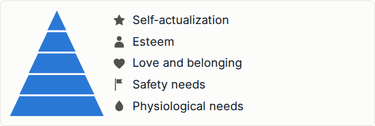 |

```html
<div data-infograph="pyramid">
  <ul>
    <li data-icon="star">Self-actualization</li>
    <li data-icon="person">Esteem</li>
    <li data-icon="heart">Love and belonging</li>
    <li data-icon="flag">Safety needs</li>
    <li data-icon="drop">Physiological needs</li>
  </ul>
</div>
```

### `cycle` — a process that repeats


```html
<div data-infograph="cycle">
  <ul>
    <li>Plan</li>
    <li>Do</li>
    <li>Check</li>
    <li>Act</li>
  </ul>
</div>
```

First stage sits at the top, the rest proceed clockwise, and the last one closes back to the first
— the whole reason this is a separate form from `flow`: a straight sequence ends, a cycle doesn't,
and a reader has to be told which one they're looking at. The accessible name states the closure
explicitly ("Plan → Do → Check → Act → Plan"), since nothing about reading the labels left to right
would otherwise convey that it loops.

The connectors are real arcs along the ring, not straight lines between stages — straight chords
between four stages trace a rhombus, not a circle. Connectors are chrome, not a mark: they stay one
neutral colour regardless of `data-emphasis`, the same rule `flow`'s arrows already follow.

| Attribute              | Meaning                                                            |
| ---------------------- | ------------------------------------------------------------------ |
| `<li>` / `data-stage`  | One stage's label, in order around the ring                        |
| `data-emphasis`        | Which stage(s) to emphasise (1-based, comma-separated for several) |
| `data-icon` on a stage | See [Icons](#icons) below                                          |

A cycle stays readable for two to eight stages.

**With an icon on every stage** — `data-icon` on the `<li>`, above the stage it names. The ring
grows slightly to keep the taller labels clear of the arcs; a stage with no icon keeps the plain
single-line label it has always had.

| No icons                                                                          | With `data-icon`                                                                     |
| --------------------------------------------------------------------------------- | ------------------------------------------------------------------------------------ |
|  | 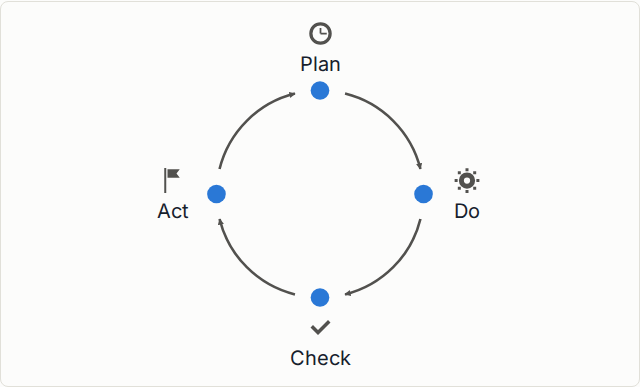 |

```html
<div data-infograph="cycle">
  <ul>
    <li data-icon="clock">Plan</li>
    <li data-icon="gear">Do</li>
    <li data-icon="check">Check</li>
    <li data-icon="flag">Act</li>
  </ul>
</div>
```

### `quadrant` — four labelled buckets


```html
<div
  data-infograph="quadrant"
  data-x-label="Urgency"
  data-columns="Urgent, Not urgent"
  data-y-label="Importance"
  data-rows="Important, Not important"
>
  <div data-label="Do First">
    <ul>
      <li>Fix production bug</li>
      <li>Client deadline today</li>
    </ul>
  </div>
  <div data-label="Schedule">
    <ul>
      <li>Plan Q3 roadmap</li>
    </ul>
  </div>
  <div data-label="Delegate">
    <ul>
      <li>Answer routine emails</li>
    </ul>
  </div>
  <div data-label="Eliminate">
    <ul>
      <li>Check social media</li>
    </ul>
  </div>
</div>
```

Four children, in reading order — top-left, top-right, bottom-left, bottom-right. This is not a
scatter plot: no item sits at a computed (x, y). Each quadrant is a bucket, and which bucket an item
is in is the entire claim — the same shape `readItems()` already returns for every other form, so
`<li>`, `data-item` children, and the `data-items` shorthand all work inside each cell for free.

**Name both ends of each axis.** `data-x-label="Urgency"` says only _what_ is measured, never _which
way_ it grows, which leaves a reader reverse-engineering the direction from the cell titles — and in
the Eisenhower matrix they will usually get it wrong, because urgency increases leftward and
importance upward, the opposite of the "right and up mean more" habit every other chart teaches.
`data-columns` names the left and right columns, `data-rows` the top and bottom, in that order.

There is deliberately no arrow: a quadrant's axes are binary — four buckets is two levels by two
levels — so an arrow would imply a continuum the form doesn't have, and would put the direction back
into geometry where assistive tech can't reach it.

A cell with no `data-label` advises: without a title, the only way to know what a cell means is its
position relative to the axis labels, and that meaning would be invisible to assistive tech.
`data-emphasis` highlights one or more cells, same rule as `bar`.

| Attribute                       | Meaning                                                           |
| ------------------------------- | ----------------------------------------------------------------- |
| `data-columns`                  | The two column names, left then right                             |
| `data-rows`                     | The two row names, top then bottom                                |
| `data-x-label` / `data-y-label` | What each axis measures — the dimension's name                    |
| `data-label` on a cell          | That cell's title                                                 |
| `<li>` / `data-item` in a cell  | One task in that cell                                             |
| `data-emphasis`                 | Which cell(s) to emphasise (1-based, comma-separated for several) |
| `data-icon` on a cell           | See [Icons](#icons) below                                         |

Both halves earn their place: a BCG matrix wants `data-x-label="Market share"` _and_
`data-columns="High, Low"` — "High / Low" alone says nothing about what is high, and "Market share"
alone is the ambiguity this section is about.

Keep each cell to a handful of items — a quadrant is for narrowing down what matters, and a cell
with a dozen unsorted tasks in it has stopped doing that.

### Pictogram marks

`waffle` and `bar` can draw their marks as silhouettes instead of blocks. Add `data-ig-symbol`:


```html
<div
  data-infograph="waffle"
  data-value="43.8%"
  data-label="Respondents who agreed"
  data-ig-symbol="person"
></div>
```

Nothing about the encoding changes — still a hundred cells, still one per unit, still counted in
rows. The silhouette only changes what shape each cell is painted in.

For `bar`, say what one symbol is worth with `data-ig-symbol-unit`:

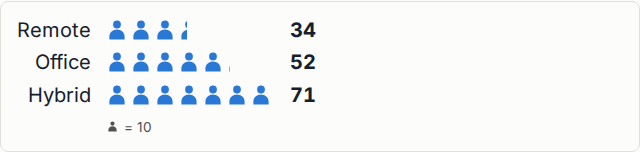

```html
<div
  data-infograph="bar"
  data-label="Where people work each week"
  data-ig-symbol="person"
  data-ig-symbol-unit="10"
  data-items="Remote: 34, Office: 52, Hybrid: 71"
></div>
```

The count is then the value: 34 is three symbols and a bit, and the "bit" is a **clipped** symbol
rather than a smaller one. Leave `data-ig-symbol-unit` out and a round number is chosen for you and
printed under the chart — a chart of symbols with no stated unit cannot be read at all.

| Attribute             | Meaning                                                                   |
| --------------------- | ------------------------------------------------------------------------- |
| `data-ig-symbol`      | One of `square` `circle` `person` `building` `tree` `drop` `heart` `star` |
| `data-ig-symbol-path` | Your own outline instead — any SVG path drawn on a 24×24 grid             |
| `data-ig-symbol-unit` | `bar` only. What one symbol represents. Derived and stated if omitted     |

Both `symbol` and `symbolPath` also work deck-wide (`infograph: { symbol: 'person' }`), and
`data-ig-symbol="square"` opts one figure back out.

**Why there is no "fill one big silhouette to 43%" option.** Repeating a symbol keeps the reading
task as counting; scaling one symbol turns it into judging an area, which is both far less accurate
and the classic way a pictorial chart misleads. That is Otto Neurath's original ISOTYPE rule — _a
sign is repeated, never enlarged_ — and it is why this feature is a mark, not a decoration. Repeated
pictographs have been measured as costing no reading accuracy while helping recall (Haroz, Kosara &
Franconeri, CHI 2015). See [docs/principles.md](docs/principles.md#5b-a-sign-is-repeated-never-enlarged).

For a custom shape, draw it on a 24×24 square and keep it a solid silhouette — it is painted as a
mask, so only the shape matters, never its colours:

```html
<div data-infograph="waffle" data-value="62%" data-ig-symbol-path="M12 2 2 22h20z"></div>
```

### Icons

`flow`, `pyramid`, `cycle` and `quadrant` can attach an icon to each of their elements —
a stage, a tier, a stage on the ring, a cell — with `data-icon`:

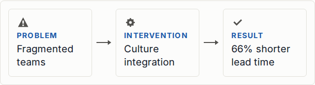

```html
<div data-infograph="flow">
  <div data-step="Problem" data-icon="alert">Fragmented teams</div>
  <div data-step="Intervention" data-icon="gear">Culture integration</div>
  <div data-step="Result" data-icon="check">66% shorter lead time</div>
</div>
```

**This is not `data-ig-symbol`, and the two solve different problems.** A symbol is a _mark_,
repeated once per unit, so its count carries a quantity — that is the whole subject of
[Pictogram marks](#pictogram-marks) above. An icon here carries no quantity: it sits exactly once,
next to the one label it names, and it never varies in size. It restates an identity the visible
text already states, the same way a diagram in a textbook sits an icon beside a caption rather than
scaling the icon to match the caption's importance. The moment an icon's size tracked a value it
would become the same area-judgement failure `data-ig-symbol` is built to avoid — so nothing here
lets that happen. See
[docs/principles.md §5c](docs/principles.md#5c-an-icon-names-it-never-measures).

Four notations, most explicit wins:

```html
<!-- A built-in name. -->
<div data-step="Plan" data-icon="clock"></div>

<!-- Your own solid silhouette, drawn on a 24×24 grid. -->
<div data-step="Plan" data-icon-path="M12 2 2 22h20z"></div>

<!-- Your own raster image instead, masked by its own alpha channel. -->
<div data-step="Plan" data-icon-src="/assets/handshake.png"></div>

<!-- Or bring an icon set's own glyph, stroked or filled, pasted in unchanged. -->
<div data-step="Plan">
  <svg data-icon viewBox="0 0 24 24" fill="none" stroke="currentColor" stroke-width="2">
    <circle cx="12" cy="12" r="9" />
  </svg>
</div>
```

| Attribute         | Meaning                                                                                                                         |
| ----------------- | ------------------------------------------------------------------------------------------------------------------------------- |
| `data-icon`       | One of `check` `flag` `clock` `target` `alert` `lightbulb` `gear` `document`, plus the [pictogram mark](#pictogram-marks) names |
| `data-icon-path`  | Your own solid silhouette instead — an SVG path drawn on a 24×24 grid                                                           |
| `data-icon-src`   | Your own raster image instead — a URL, masked the same way, painted from its alpha channel                                      |
| `<svg data-icon>` | An inline SVG child — the escape hatch for a stroked icon set                                                                   |

`data-icon-src` paints exactly like the other notations — same mask, same `currentColor`, same fixed
size — with one difference worth knowing before you reach for it. It is a mask, not a picture: the
image's own colours are discarded, and the shape comes from its alpha channel, so a fully opaque
image (a plain photo, a flat-background PNG) paints as a solid square rather than a silhouette — use
an image that is already transparent outside the glyph. And unlike the other three, which are
inlined so a figure never depends on a network round-trip, this one is a URL the browser fetches: use
a `data:` URI, or a same-origin asset your deck already preloads, to keep the resting state the
finished state.

An icon needs its own element's visible label, or it says nothing to a screen reader — icons are
`aria-hidden`, same as every other purely graphical mark this package draws. An icon on an
otherwise-unlabelled stage, tier or cell advises; so does icon-ing some elements in a figure and not
others, since a lone icon among plain siblings reads as `data-emphasis` rather than as a deliberate
style choice. There is deliberately no deck-wide `data-icon` default — unlike a mark, which
legitimately serves a whole deck, the same icon on every element of every figure would name nothing.

### `auto` — let intent choose the form

```html
<div
  data-infograph="auto"
  data-intent="part-of-whole"
  data-value="62%"
  data-label="Retention rate"
></div>
```

| `data-intent`   | Resolves to                        | Why                                            |
| --------------- | ---------------------------------- | ---------------------------------------------- |
| `compare`       | `bar` (or `compare` for two items) | Length on a common baseline                    |
| `part-of-whole` | `waffle`                           | A countable grid, not angle                    |
| `change`        | `compare`                          | Two points in time, delta included             |
| `flow`          | `flow`                             | Order with an explicit connector               |
| `overlap`       | `venn`                             | The one case where area is actually the point  |
| `single`        | `stat`                             | It's text, not a figure                        |
| `hierarchy`     | `pyramid`                          | Ranked levels, width states rank not magnitude |

---

## Behaviour options (`data-ig-*` and deck config)

Deck-wide defaults come from the reveal config.

```js
initReveal({
  infograph: { duration: 700, density: 'compact' },
});
```

Override one figure at a time with `data-ig-*`.

| Key          | `data-ig-*`           | Default       | Meaning                               |
| ------------ | --------------------- | ------------- | ------------------------------------- |
| `palette`    | `data-ig-palette`     | `default`     | Palette name                          |
| `density`    | `data-ig-density`     | `comfortable` | `compact` tightens spacing            |
| `legend`     | `data-ig-legend`      | `false`       | Use a legend instead of direct labels |
| `animate`    | `data-ig-animate`     | `true`        | Entrance animation                    |
| `duration`   | `data-ig-duration`    | `600`         | Animation duration (ms)               |
| `delay`      | `data-ig-delay`       | `100`         | Delay after the slide appears (ms)    |
| `maxSeries`  | `data-ig-max-series`  | `4`           | Advises past this many series         |
| `symbol`     | `data-ig-symbol`      | —             | Silhouette for `waffle` / `bar` marks |
| `symbolPath` | `data-ig-symbol-path` | —             | A custom 24×24 outline instead        |
| `quiet`      | —                     | `false`       | Silences advisory messages            |

Writing `data-ig-legend` with no value means `true` (same convention as reveal's own
`data-auto-animate`).

Every form accepts a `data-caption`.

---

## About advisory messages

Writing something that violates a principle **warns, but still renders**.

```
[infograph] bar has 6 items; more than 4 is hard to hold in mind
  → Show the top few and roll the rest into "Other", or split across slides.
```

Ten minutes before you're on stage, a working figure beats a perfect one. Set
`infograph: { quiet: true }` to silence these.

---

## Using it alongside other plugins

### count-up

Numbers render as plain text (`.ig-stat-value` etc.), so `data-count-up` counts them up like any
other element.

```html
<div data-infograph="stat" data-value="43.8%" data-label="Agreed" data-count-up></div>
```

**Don't put it on an auto-animate pair target**, though — reveal can match unlabelled elements by
text content, and that collides with the mid-animation rewrite.

### auto-animate

Give an element `data-id` and the generated elements get a stable `data-id` too (`ig-<id>-value`
etc.), so they can morph between slides.

```html
<section data-auto-animate>
  <div data-infograph="venn" data-id="thesis" data-overlap="0.05" data-a="A" data-b="B"></div>
</section>
<section data-auto-animate>
  <div data-infograph="venn" data-id="thesis" data-overlap="0.55" data-a="A" data-b="B"></div>
</section>
```

Don't set `center: false` in the deck config. With `center: false`, reveal measures auto-animate
pairs via `offsetLeft`/`offsetWidth`, which don't exist on SVG elements — the venn animation
silently dies as `translate(NaNpx, NaNpx)`.

---

## Adding a custom form

```js
import { registerForm, el, cls, figure } from 'revealjs-infograph';

registerForm('gauge', ({ host, config }) => {
  const value = host.dataset.value;
  return figure({
    form: 'gauge',
    label: `Gauge ${value}`,
    visual: el('div', { class: cls('gauge') }, value),
  });
});
```

A form is a pure function `(context) => HTMLElement`. It gets the same lifecycle, animation,
config resolution, and accessibility scaffolding as the built-in forms.

---

## Contributing

Development commands and the visual-test setup live in [CONTRIBUTING.md](CONTRIBUTING.md).

---

## License

MIT
